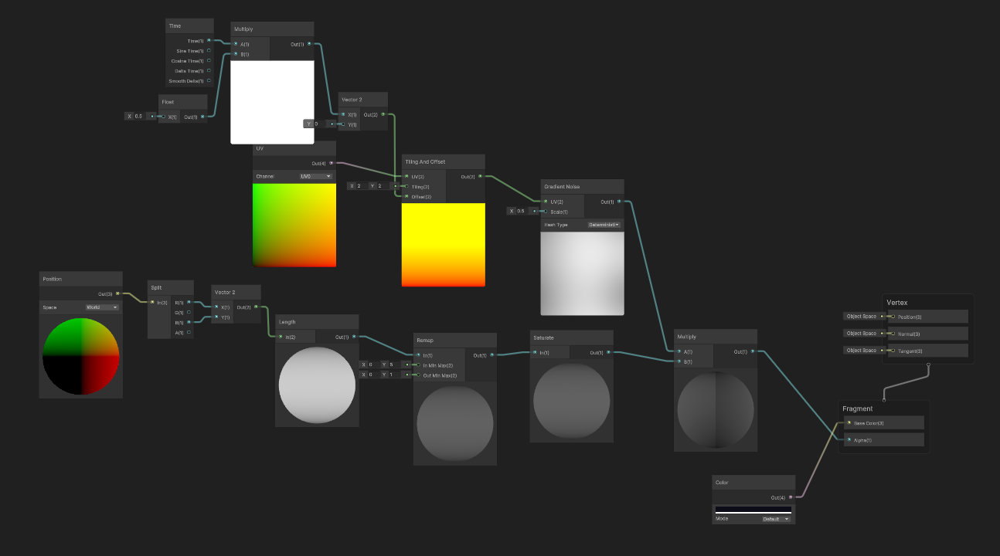

# GDIM33 Vertical Slice [impact zone]

## Milestone 1 Devlog

1. Going into this, I thought Visual Scripting would be easier than writing everything in C#, but that didnt really end up being the case. Troubleshooting the graph was honestly more confusing than I expected, mostly because the errors arent as clear as they are in code. With C#, you usually get a pretty direct message about whats wrong, but with graphs it felt more like guessing sometimes. The graph I made runs every frame using an On Update event and checks the players current state from the PlayerController script. From there, it grabs the players renderer and uses a Select On Enum node tied to my PlayerState enum to decide what color the player should be. Each state has its own color blue for Idle, green for Move, red for Attack, and yellow for Dash. Using color instead of animations was a really practical decision at this stage. It let me clearly see when states were changing without having to deal with importing and setting up animations yet. It made the state machine a lot easier to understand while I was building and testing everything.

2. The biggest change I made to my breakdown since the pitch was adding the player state machine, which kind of became the core of how the Player system works. Like I mentioned in the other part Im using four states right now Idle, Move, Attack, and Dash and each one controls what the player can and cant do at that moment. Switching between them is based on input, so clicking Mouse1 while moving or idle puts you into Attack, pressing Space triggers Dash, and letting go of movement sends you back to Idle. Treating each state as its own behavior instead of just flipping booleans made things a lot easier to manage, especially for stuff like preventing a dash during an attack or making sure the hitbox only activates at the right time.

The Attack state is what triggers the hitbox, which is how enemies actually take damage, so that ties directly into the NPC system. The Dash state connects to the HUD with a cooldown indicator so the player can tell when its ready again, which links it to the UI. On top of that, enemies are always pathfinding toward the player using NavMesh, no matter what state the player is in, so how the player moves still affects how enemies react and reposition. I left environmental hazards out for now on purpose since I see them as the complicating factor for the vertical slice, and this milestone is really just about getting the core gameplay working first.

updated breakdown 
https://docs.google.com/drawings/d/1DXblBBuUiLAm_IhuKVVHFLm77iD_1kcDLqdRKewiVvY/edit?usp=sharing 

## Milestone 2 Devlog
So, I technically used the W5 activity to work on my proper complicating factor mentioned in my vertical slice document, and I scrambled for an idea that I should use Milestone 2 to work on. So I decided to work on a new 'push' mechanic that I didn't think would get into the game afterall. 

### Devlog Q1 
The complicating factor I'm building for Milestone 2 is a directional push mechanic bound to Mouse2. The push acts as a short range shove that launches enemies away from the player in the direction the reticle is aiming, mirroring how the standard attack works directionally. The intent is to give the player a tool to manage crowding, when multiple enemies are closing in from different angles, the push creates breathing room without dealing damage. It's designed to feel like a shorter, outward version of the dash, and it sets up the environmental hazards by giving the player a way to actively knock enemies into them.

1. Add the Push State and Input
    - Add a Push state to the PlayerState enum alongside Idle, Move, Attack and Dash
    - Bind the push action to Mouse2 in PlayerController
    - Define the push duration and a cooldown so it can't be spammed
    - Ensure the push state integrates cleanly into the existing state machine transitions

2. Implement the Directional Knockback on Enemies
    - Use the reticle's aim direction to determine the push direction
    - Use Physics or an impulse force to launch enemies in that direction on contact
    - Add a knockback method to EnemyController that receives a direction and force 
    - Tune the push distance to feel distinct from the dash but impactful enough to be useful

### Devlog Q2 
Honestly the task breakdown helped a lot more than I expected it to. Breaking the push mechanic into two big steps building the state and input first, then handling the directional knockback separately made it a lot easier to digest the work in chunks rather than looking at it as one big intimidating feature. It also helped when I had to step away and come back to it the next day, because I could just look at the breakdown and know exactly where I left off. If I were to improve it I'd probably take the time to write it on a big whiteboard or something if I had one at my disposal in my room or something. Having a tangible list of to-dos genuinely made the whole thing feel like i was making progress in chunks kinda like how I feel when I push commits on github.

### Devlog Q3
For this milestone I set up a custom event system where EnemySpawner.cs fires a named event called OnWaveUpdate using Unity Visual Scripting's EventBus.Trigger, passing a WaveUpdateArgs object containing the current wave number and enemy count. After getting lost in the sauce with youtube tutorials I ended up doing a lot and still came up short. The intent was for a Visual Script graph on the Canvas to receive that event, extract the wave and enemy count values using Wave Update Args: Get Wave and Wave Update Args: Get Enemy Count nodes, and then call UpdateWaveUI on PlayerHUD.cs to update the on-screen text. The graph is built and the node connections are in place, but I couldn't get the event to trigger the graph during troubleshooting in time I had for this milestone. This is entirely on me because I'm just juggling so many projects right now. The C# script involved is EnemySpawner.cs which contains the FireUpdateEvent method, and PlayerHUD.cs which contains the UpdateWaveUI method the graph was intended to call. 

### Devlog Q4
The Unity system I'd like graded for Feature 3 is NavMesh. Enemies use NavMesh Agents to pathfind toward the player across the arena, and the spike trap hazards have NavMesh Obstacle components with Carve enabled so enemies actively path around them rather than walking into them. You can see this in action by watching how enemies navigate around the spike traps in the arena during any wave.

## Milestone 3 Devlog

1. I created a shader graph called ArenaFog, which is an Unlit Shader Graph with its Surface Type set to Transparent and Blend Mode set to Alpha. This allows it to render as a semi-transparent plane that sits just above the terrain.

    The shader works by using the world position of each pixel on the fog plane through a Position node set to World space. The position is split into its X and Z components with a Split node, then combined into a Vector2 so only the horizontal position is used. A Length node calculates how far each pixel is from the world origin, and a Remap node converts that distance into a 0-1 range based on the size of the arena. Pixels closer to the center become more transparent, while pixels nearer the edges become more opaque.

    To make the effect look more like natural fog instead of a simple radial gradient, I layered Gradient Noise over the transparency mask using a Multiply node. This creates a softer, uneven appearance. The noise is passed through a Tiling and Offset node connected to a UV node, while a Time node multiplied by a small float value drives the offset. This causes the noise pattern to slowly drift across the plane, giving the fog subtle movement and helping hide any visible tiling.

    The final result is fed into the Alpha channel of the Fragment output, while a dark color is connected to the Base Color input. In the scene, the fog plane sits just above the terrain and covers the entire arena, creating a low-lying atmospheric mist effect around the edges of the map.

2. Based on feedback from the M2 playtest, I made several improvements to the project. The placeholder capsules were replaced with fully textured character models and animations, with Jill Valentine representing the player and animated zombie models representing enemies. The level was redesigned from a simple grey arena into a terrain-based outdoor environment with textures, props, lighting, and rebaked navigation for NPC movement. I also upgraded the camera to a smooth follow camera and improved player rotation so the character faces their movement direction, making animations look much more natural.

3. Since Milestone 2, I added a significant amount of new content to complete the intended gameplay experience. The player and all enemy variants now use fully textured and animated character models, replacing the placeholder assets entirely. The arena was rebuilt as a Resident Evil-inspired outdoor environment featuring terrain textures, trees, lighting, and a custom fog shader, while a spotlight attached to the player helps reinforce the atmosphere. These additions bring the project much closer to its original vision of a PS1-style arcade brawler with distinct enemy types, a readable environment, and a complete three-wave gameplay loop.
## Milestone 4 Devlog
Milestone 4 Devlog goes here.
## Final Devlog
Final Devlog goes here.
## Open-source assets
- Cite any external assets used here!
